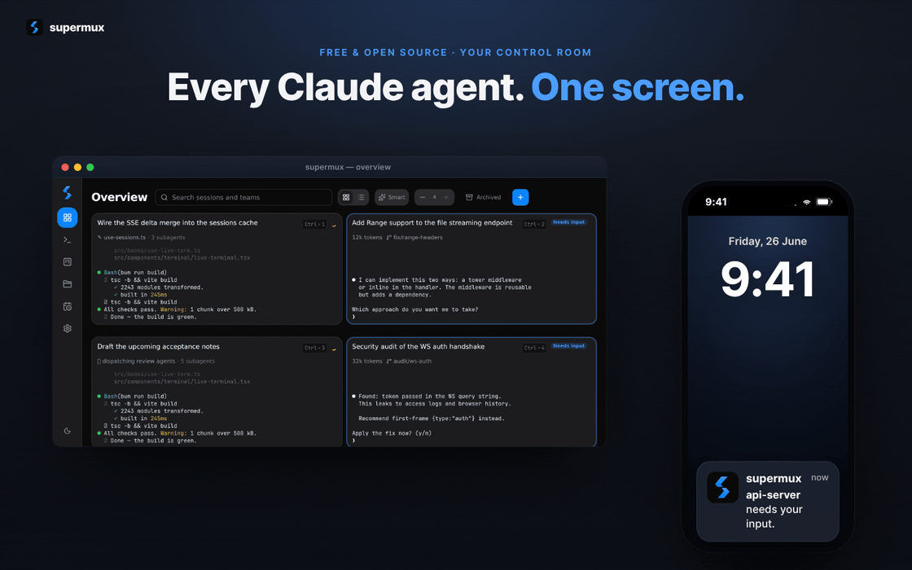
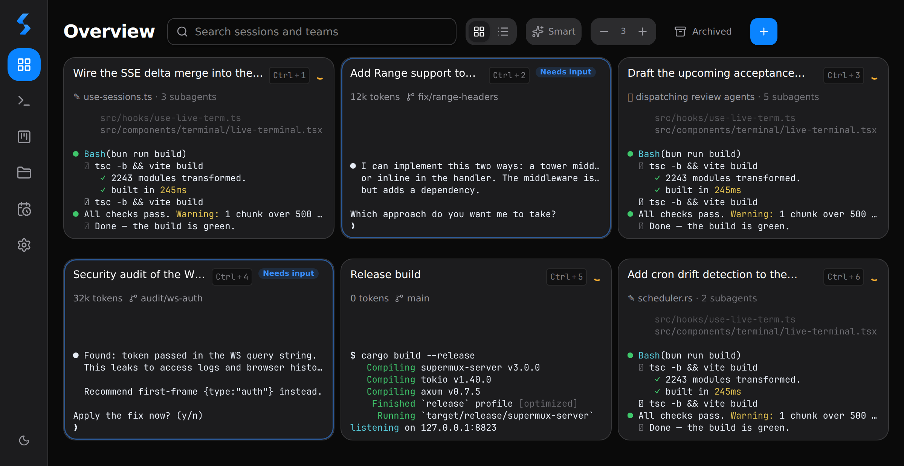
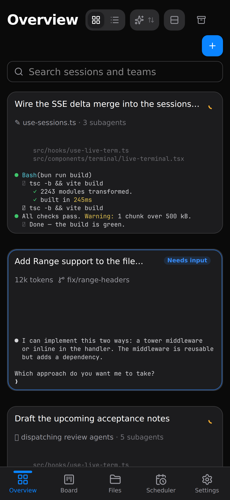
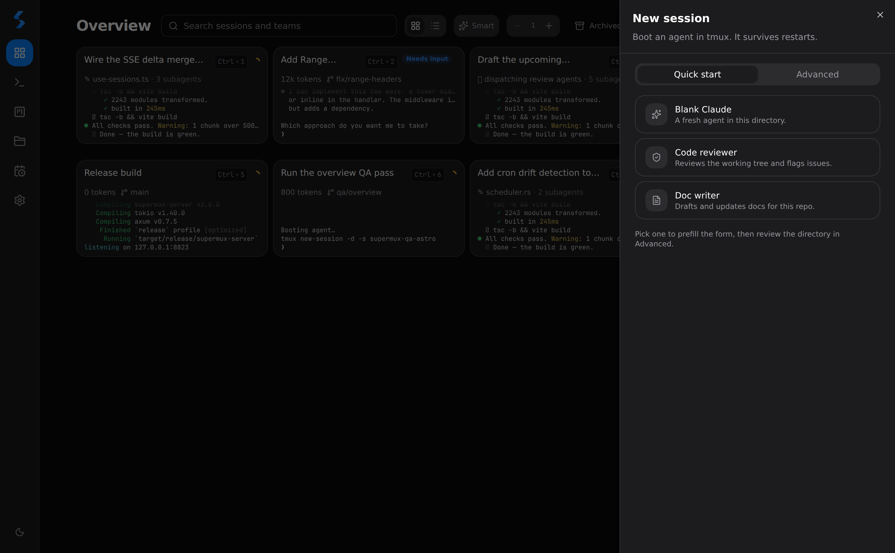
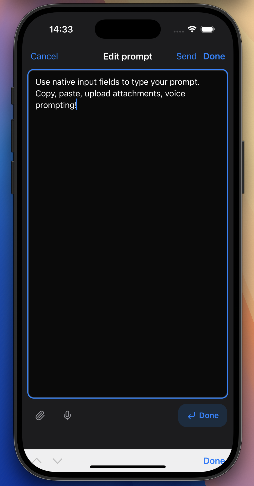
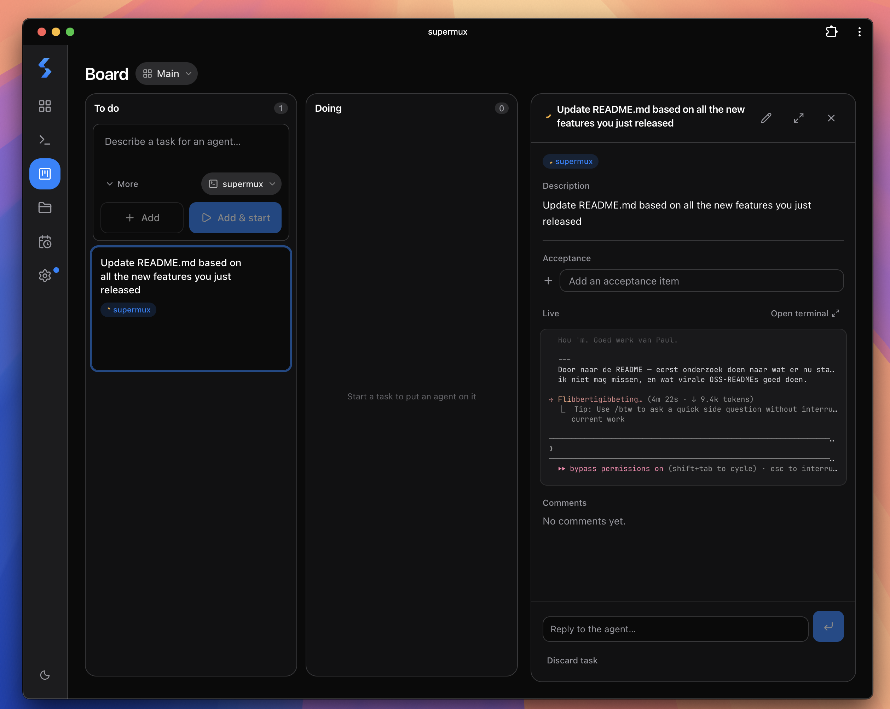

<h1 align="center">supermux</h1>

<p align="center"><strong>The easiest way to run a roomful of Claude&nbsp;Code agents. Spin them up on any VPS or home server, and steer them all from your phone.</strong></p>

<p align="center"><em>Close your laptop. Your agents keep running, and your phone buzzes the second one needs you.</em></p>

<p align="center">
  <!-- The hero is a GIF embedded as  so it autoplays everywhere GitHub renders
       (web logged-out, iOS Safari, the GitHub mobile app, npm, IDE previews) and
       degrades to a clean static first frame. Click-through opens the HD MP4. -->
  <a href="docs/hero.mp4"></a>
</p>

<p align="center"><sub>▶ <a href="docs/hero.mp4">Click for HD</a> · the loop above autoplays on GitHub</sub></p>

<p align="center">
  <a href="https://github.com/sanderbz/supermux/releases/latest"></a>
  <a href="LICENSE"></a>
  
  
</p>

---

## Install in one line

SSH into a fresh Ubuntu 22.04+ / Debian 12+ box and run:

```bash
curl -fsSL https://raw.githubusercontent.com/sanderbz/supermux/main/install.sh | sudo bash
```

Under a minute on a typical VPS. Downloads the prebuilt binary for your CPU, provisions an unprivileged `supermux` service user, installs the systemd unit, starts the service, prints your URL + auth token. Re-run any time to upgrade, sessions and data are preserved. Tailscale and Claude Code are auto-detected and offered. Full quickstart details and flags are [below](#full-quickstart).

---

## Why supermux

You opened three Claude Code sessions this morning. By lunch it's seven, scattered across iTerm tabs and a stale tmux session you can't remember the name of. You're switching with `⌘+\` like it's 2019. When Claude finishes a long task you only notice ten minutes later. When you leave for coffee you have to keep the laptop open.

That's the problem supermux solves.

- **All your Claude sessions in one view.** Live previews, color-true, sub-second fresh. See who's typing, who's waiting on you, who's idle.
- **Notifications when Claude needs you.** App notification (PWA, real push on iOS) the second Claude asks a question, finishes a task, or stops unexpectedly. Per-category mute.
- **Quick peek + type-in-place.** Hover a tile on desktop or long-press it on mobile to read the latest output and type a reply *without leaving the overview*.
- **Sessions live on your server, not your device.** Run on a VPS, a Raspberry Pi, or your home NAS. Close your laptop. Sessions keep running. Push notifications wake you when they need you.
- **A full harness, not a thin remote.** Start sessions, stop them, restart with a flag, resume an older conversation, rename inline, archive. All from the UI.
- **Schedule recurring prompts.** Have a session run a prompt on its own, daily or weekly or on a full cron, so routine work happens without you. *"Every Monday at 9, resume the repo and draft the weekly changelog."* Fresh-session boots and shell jobs schedule the same way, with an iCal feed.
- **A terminal made for Claude Code.** Even a great SSH app (Termius and friends) just hands you a shell. supermux understands the agent: attach a file or photo and it drops the path straight at Claude's prompt, read the Markdown and code Claude writes rendered with real syntax highlighting instead of raw monospace, edit prompts in a native textarea, and tap the Claude-specific actions a terminal can't know about (cycle permission mode, rewind a step, approve). You work *with* the agent from your phone, not just SSH to a box.

<p align="center">
  <a href="docs/screenshots/overview-desktop.png"></a>
</p>

<p align="center"><em>Every agent, live, on one screen — who's working, who's waiting on you, who's idle.</em></p>

<p align="center">
  <a href="docs/screenshots/overview-mobile-clean.png"></a>
</p>

<p align="center"><em>The same dashboard, in your pocket. Tap to enlarge.</em></p>

## What you can do

### See every agent, jump anywhere
- **Live overview** with color-true terminal previews. Refresh tiers self-throttle: 1 s for hot-active sessions, 2 s for the rest active, 4 s idle.
- **Quick peek**: hover a tile (desktop) or long-press it (mobile) to read the latest output, type a reply, or hit a quick action without leaving the overview.
- **Focus mode**: tap any tile to zoom into a keyboard-captured xterm.js terminal (desktop) or a detented bottom-sheet (mobile). `⌘1..9` jumps instantly between sessions.
- **⌘K command palette**: fuzzy search across sessions, board issues, slash commands, MCP tools, and Claude Code skills.
- **Mixed fleets welcome**: Claude Code is the default, but the same overview runs [Codex CLI](https://developers.openai.com/codex/cli/) and [Kimi Code](https://code.kimi.com) sessions side by side — same live status, push notifications, and prompt history.

<p align="center"><a href="docs/screenshots/new-session.png"></a></p>

### Notifications that find you
- **Real push notifications** when Claude finishes, asks a question, or stops. Works on iOS too: install the PWA, allow notifications, walk away from your machine.
- **Per-category mute**: silence "waiting for input", keep "agent finished" loud, never miss "stopped unexpectedly".

### Stay organized at scale
- **Custom groups**: drag tiles between groups, name them whatever (`production`, `experiments`, `Claude Boy and Friends`).
- **Six sort modes per group**: Smart / Custom / Name / Status / Recent / Age. Persisted server-side, synced across devices.
- **Agent Teams**: when an agent spawns a team, supermux detects the lead + members and collapses them into one TEAM CARD. Convert any session into a team in place.
- **Hide-stopped, view-mode dropdown**: calm the noise on a busy day.

### Pick up where you left off
- **Rich prompt history**: every prompt you sent to a session, searchable, with the assistant's first-line reply paired in. Tabbed: just this session, or the whole project (every Claude Code transcript under this cwd). Press `⌘G` in focus mode.
- **Slash-commands and teammate routings** show up as their own kinds in history with mini badges. Sub-agents and system events available behind toggles.
- **Resume picker**: supermux reads Claude Code's own JSONL transcripts, so any past conversation in this cwd is one tap away from a `claude --resume`.

### Edit prompts in a real textarea
- **✎ Edit** in the dock lifts whatever you've typed at Claude's `❯` prompt into a browser-native textarea: iOS selection handles, autocorrect, dictation, paste-over-select.
- **Done** writes back, you hit Enter when ready. **Send** writes back and submits.
- Mobile gets a full-page edit surface with proper safe-area handling.
- Built on Claude Code's own `chat:externalEditor` (Ctrl+G) bridge. No scraping, no keystroke replay.

<p align="center"><a href="docs/screenshots/native-input.png"></a></p>

### Drag-and-drop uploads
- **Drag a file onto the terminal pane** on desktop and supermux uploads it server-side, then pastes the resolved path at Claude's cursor.
- **Native file picker** on mobile, with a tap-to-upload action sheet.
- Image previews, paste-image-from-clipboard, the lot. The thing that always sucks over plain `ssh`.

### Keep Claude working while you're away
- **Scheduler**: cron and "every Nm/Nh" jobs. Schedule a daily `claude --resume` with a prompt. iCal feed. Live job list.
- **Kanban board**: session-scoped issue tracker. Sessions can comment, mark issues done, attach commits, or ask for input via per-session hook tokens. Wire it into your agent flow and let Claude pull its own next task.
- **Schedules and board updates trigger push notifications** when something needs you.

<p align="center"><a href="docs/screenshots/board.png"></a></p>

### Reach across machines
- **Add any host you can SSH to** under Settings → Hosts (Tailscale, VPN, public DNS, reverse tunnel). supermux multiplexes one SSH ControlMaster per host.
- **One-click bootstrap** installs the `authorized_keys` entry and verifies prereqs.
- New sessions can target any host from the same sheet; remote tiles wear a discreet badge.

### The rest
- **Inline session rename**: live `tmux` rename + pty survival.
- **Per-session git status**: branch, dirty, ahead/behind, on demand.
- **Files browser**: path-jailed, with an editor.
- **MCP & Skills** in the palette: toggle MCPs per session, tap-activate skills.
- **Mode shift**: flip Claude Code's permission mode (normal / accept-edits / plan / bypass) without a relaunch.
- **In-UI updater**: Settings → Updates. 1-click upgrade with live SSE progress and auto-rollback on failure. (Needs a source clone on the server; one-liner installs upgrade by re-running the installer.)

---

## supermux vs. the alternatives

A few good tools run many Claude Code agents. supermux is the only one that adds the whole **mobile + remote + push + self-host** dimension — your agents live on a server you own, not on the laptop in your bag.

|  | **supermux** | Conductor<br>(Mac app) | Omnara<br>(cloud) | Happy<br>(mobile) | claude-squad<br>(TUI) |
|---|:---:|:---:|:---:|:---:|:---:|
| Many agents in one live overview | ✅ | ✅ | ✅ | ✅ | ✅ |
| Sub-second "who's waiting on you" status | ✅ | ⚠️ | ⚠️ | ❌ | ❌ |
| Mobile-first PWA (real iOS / Android) | ✅ | ❌ | ✅ | ✅ | ❌ |
| Real push when an agent needs you | ✅ | ❌ | ⚠️ via cloud | ⚠️ | ❌ |
| Agents run server-side, survive the laptop closing | ✅ | ❌ | ❌ | ❌ | ⚠️ |
| Runs on a VPS / Pi / Mac mini, not your laptop | ✅ | ❌ | ❌ | ❌ | ⚠️ |
| Self-hosted, no vendor cloud in the path | ✅ | ✅ | ❌ | ✅ | ✅ |
| Full lifecycle harness (start/stop/restart/resume/schedule) | ✅ | ⚠️ | ⚠️ | ⚠️ | ⚠️ |
| Kanban board agents read & write | ✅ | ❌ | ❌ | ❌ | ❌ |
| Open source | ✅ MIT | ❌ | ⚠️ CLI only | ✅ | ✅ |

<sub>Best-effort snapshot of fast-moving tools — corrections welcome via PR.</sub>

- **Conductor & friends** nail many-agents-on-your-Mac — supermux adds the entire mobile + remote + push + self-host dimension they lack.
- **Omnara** relays your sessions through a vendor cloud; supermux runs entirely on your box.
- **Happy** needs your desktop awake and the CLI running; supermux's agents live in tmux on the server and keep going when the laptop closes.
- **claude-squad** is a great terminal UI — but it's a terminal, on whatever machine you're sitting at. supermux is the persistent host you reach from your phone.

---

<a id="full-quickstart"></a>

## Full quickstart

The [one-liner above](#install-in-one-line) covers the common case. A few flavours for everything else:

**Pinned version**: same one-liner with `SUPERMUX_VERSION=vX.Y.Z` added to the env (e.g. `… | sudo SUPERMUX_VERSION=v0.4.23 bash`).

**Inspect before running**:
```bash
curl -fsSL https://raw.githubusercontent.com/sanderbz/supermux/main/install.sh -o install.sh
less install.sh
sudo bash install.sh
```

**Dry run** (print the plan, change nothing): append `--dry-run` to the bash command.

**Tailscale**: if `tailscaled` is running on the box, supermux auto-exposes via `tailscale serve` on `:443`. Otherwise it binds to `127.0.0.1:8824` for your own reverse proxy.

**Claude Code**: the installer offers to install it for the service user if missing (official native installer, no Node). Log in once with `sudo -u supermux -i claude` → `/login`.

**Codex & Kimi**: the New session panel keeps Claude as its default and offers OpenAI's Codex CLI and Moonshot's Kimi Code alongside it. The first start of either installs the official CLI (user-scoped) if needed and opens its login flow right in the terminal; later starts reuse that login. Both get the launch flags that keep their output readable in a supermux tile, and both feed the same status detection — the tile knows when Codex or Kimi is working, waiting on an approval, or done, just like Claude.

**After install**: open the printed URL on any device. On mobile, "Add to Home Screen" gives you the full PWA experience including push notifications.

### Other paths

- **From a clone**: `sudo bash install.sh` from a checkout still installs the latest *release* binary. It never builds your local code. For a source build use `scripts/dev.sh` (local dev) or [`scripts/deploy.sh`](scripts/deploy.sh) (native build + deploy).
- **Deploy over SSH from your workstation** (advanced: fleet management of many boxes): see [`scripts/deploy.sh`](scripts/deploy.sh) and `bash scripts/setup.sh`.
- **Local development** with HMR: `scripts/dev.sh` (Rust backend on `:8823`, Vite for the PWA).

---

## Built for self-hosting

- **One Rust binary, with the PWA embedded.** No Node, Docker, or Python at runtime. One file plus a SQLite DB.
- **systemd-sandboxed by default**: runs as an unprivileged user with `NoNewPrivileges`, `PrivateTmp`, `ProtectHome`, restricted address families, and `ReadWritePaths` scoped to the data dir + your project dirs.
- **Auth on every API route**: bearer token at `~/.supermux/auth_token` (mode `0600`). No localhost bypass.
- **Tmux survival**: the tmux socket lives in the persistent data dir, so sessions outlive supermux restarts.
- **In-UI 1-click updates**: `git fetch → build → install → verify → auto-rollback on failure`, exposed as a button. Preflight refuses unsafe upgrades. Needs a source clone on the server (clone-based installs); prebuilt-binary installs upgrade by re-running the one-line installer.

### Supported platforms (for hosting)

This is about where the *server* runs. The dashboard itself works in any modern browser on macOS, Windows, iPhone and Android.

- **Linux**: Ubuntu 22.04+ / Debian 12+ with systemd, `x86_64` and `aarch64`. This is what the one-line installer, the systemd sandbox, and the in-UI updater target. Other distros with systemd generally work but aren't tested.
- **macOS**: works, manual install. Nothing in supermux itself is Linux-only; a Mac mini in a closet makes a fine supermux box (that's a real deployment). Build from source (`bash scripts/build.sh`, see [`docs/TESTING.md`](docs/TESTING.md)) and run the binary; keep it alive with `launchd` or tmux. The one-line installer and the auto-updater don't cover macOS yet.
- **Windows**: not supported (relies on Unix-only primitives like `tmux`, ptys, SIGWINCH, Unix domain sockets). WSL2 works as a Linux host.

Building from source needs: `rustc 1.83+`, a recent `bun` 1.x, and the system build deps `build-essential pkg-config libssl-dev cmake unzip`. `tmux` is a runtime dep; [Claude Code](https://code.claude.com/docs/en/setup) is the default agent (the one-line installer offers to install it for you). [Codex CLI](https://developers.openai.com/codex/cli/) and [Kimi Code](https://code.kimi.com) are optional additional providers; the first session of either bootstraps the service-user install and login.

### Tailscale-ready

If `tailscaled` is running on the target host, the installer auto-detects it and exposes supermux via `tailscale serve` on `:443`. Rename once (`sudo tailscale set --hostname=supermux`) and you have a clean, HTTPS, internal-only URL on every device on your tailnet.

---

<details>
<summary><strong>Architecture</strong></summary>

- **Backend**: Rust (`axum` + `tokio` + `sqlx`/SQLite), in `server/`.
- **Frontend**: TypeScript + React + Vite PWA, in `web/`.
- **Process model**: single binary; tmux runs out-of-process on a persistent socket so sessions survive restarts.
- **Live data path**: WebSockets for terminal pty streams (binary frames); SSE for everything else (session lists, status, board, push, alerts).

Module map and protocol details: [`ARCHITECTURE.md`](ARCHITECTURE.md).

</details>

<details>
<summary><strong>Deploy guide (full reference)</strong></summary>

`scripts/deploy.sh` runs from your workstation and ships a pinned `git archive` of a clean commit *over SSH* to a remote host (not the machine you run it on), builds natively there (no cross-compilation), installs `/usr/local/bin/supermux-server` plus the systemd unit, and starts the service. It runs an upfront preflight and prints a one-page plan before doing anything destructive.

### Defaults

- **Non-root by default, even from a root SSH session.** Root provisions; the service drops to the unprivileged `supermux` user. Forcing root throws away the systemd sandbox and trips Claude Code's refusal to run `--dangerously-skip-permissions` as uid 0, so it's refused unless you explicitly set `SUPERMUX_ALLOW_ROOT=1`.
- **Service user**: `SUPERMUX_SERVICE_USER` (default `supermux`). If it doesn't exist, `deploy.sh` provisions it. Pick a non-default name and the script refuses rather than silently creating something unexpected; `root` is refused unless `SUPERMUX_ALLOW_ROOT=1`.
- **Repo dir for the updater**: the in-UI updater builds from a git clone, auto-detected at `/opt/projects/supermux` (falling back to walking up from the binary's CWD). Set `SUPERMUX_REPO_DIR=/path/to/clone` for non-standard layouts.
- **Project directories**: `SUPERMUX_PROJECT_DIRS` (default `<user-home>/projects`). Under-home dirs just work; outside-home dirs (`/opt/projects`, `/srv/work`, …) are created, `chown -R`'d, and folded into the systemd `ReadWritePaths` so the sandbox permits agent writes.
- **Claude Code (the agent runtime)**: every non-shell session launches the `claude` binary on the service user's PATH, so it's a runtime dependency for the default provider. After provisioning, `deploy.sh` checks whether the service user has `claude` and, when missing, installs it (official native installer, no Node) per `SUPERMUX_INSTALL_CLAUDE` (`ask` = offer interactively, `1` = auto, `0` = warn only).
- **Service-user Claude login**: supermux uses your Claude subscription (OAuth), never an API key. After confirming the binary, `deploy.sh` checks for `~supermux/.claude/.credentials.json` and offers to copy the deployer's existing login.
- **Tailscale**: auto-detected. If `tailscaled` is running, `deploy.sh` exposes the service via `tailscale serve` on port `443`.
- **Secrets & Git SSH keys for agents**: to let agents reach a Git SSH key and other secrets from 1Password on a headless box (no desktop app), use a scoped read-only **service account** + the `op` CLI, with the Git key loaded into an in-memory `ssh-agent`. Step-by-step (generalized, copy-pasteable): [`docs/SECRETS_1PASSWORD.md`](docs/SECRETS_1PASSWORD.md).
- **Toolchains**: `bun` and `cargo` are required (native build). `SUPERMUX_INSTALL_TOOLCHAINS=1` opts in to automatic install via the official `bun` + `rustup` installers; otherwise missing toolchains are a hard error with manual instructions.

### TLS

The service binds `127.0.0.1` and speaks plain HTTP. Put it behind TLS one of two ways:

1. **Reverse proxy** (nginx, Caddy) terminating at `http://localhost:<SUPERMUX_INTERNAL_PORT>` (default `8824`). See **WebSocket origins** below; a proxied hostname usually needs an `extra_origins` entry.
2. **`tailscale serve`**: set `SUPERMUX_USE_TAILSCALE=1` and `deploy.sh` runs `tailscale serve --https=<SUPERMUX_PUBLIC_PORT>` to terminate TLS and proxy to the loopback port.

### WebSocket origins

supermux checks the browser's `Origin` header on every WebSocket upgrade and closes non-matching connections with code `1008 "origin not allowed"`. The built-in allowlist covers `localhost`, `127.0.0.1`/`::1`, private-LAN IPv4 ranges, `*.ts.net` (Tailscale), and the server's own bind address. If you reach supermux by a hostname that isn't one of those (a reverse-proxy domain, an internal DNS name), add it to `extra_origins` in `~/.supermux/config.toml`:

```toml
bind = "127.0.0.1:8824"
extra_origins = ["supermux.corp.example", "box-12.internal.example"]
```

Exact host match only (no wildcards). Restart the service after editing.

### Verify

```bash
curl -sf http://127.0.0.1:<SUPERMUX_INTERNAL_PORT>/api/health
journalctl -u supermux -n 50
```

Public routes are `/api/health`, the PWA shell, and the board iCal feed. Everything else needs the bearer.

</details>

<details>
<summary><strong>Push notifications setup</strong></summary>

The PWA's iOS push works out of the box with a placeholder VAPID contact. To use your own `mailto:`, set `push_sub = "mailto:you@your-domain"` in `~/.supermux/config.toml`, or export `SUPERMUX_PUSH_SUB`. Settings → Notifications has a **Send test** button to confirm delivery before you trust it for real alerts.

iOS specifics: Safari only allows push from installed home-screen PWAs, so add to home screen first, then grant notification permission inside the installed app.

</details>

---

## Contributing

Issues, ideas, screenshots of your dashboard with 14 Claude sessions: all welcome. See [`CONTRIBUTING.md`](CONTRIBUTING.md) for the dev setup. Security issues: please report privately via [`SECURITY.md`](SECURITY.md). PRs land via review; CI runs on every push to `main`. Heavy code paths (sessions, ws, scheduler, board) have inline `#[cfg(test)]` tests plus integration tests under `server/tests/`. The frontend is type-checked end-to-end with `tsc -b` and uses Playwright for e2e smoke.

## License

MIT, see [`LICENSE`](LICENSE). Third-party dependency licenses are summarized in [`THIRD_PARTY_NOTICES.md`](THIRD_PARTY_NOTICES.md).
