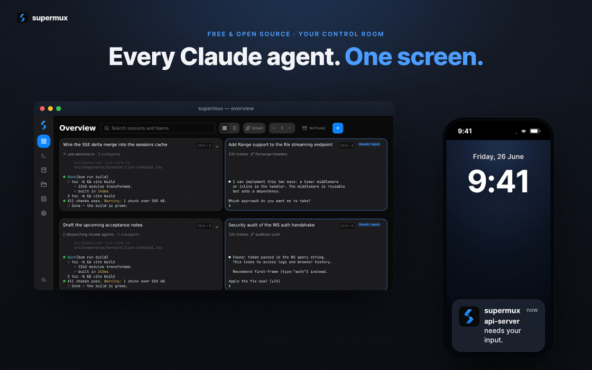
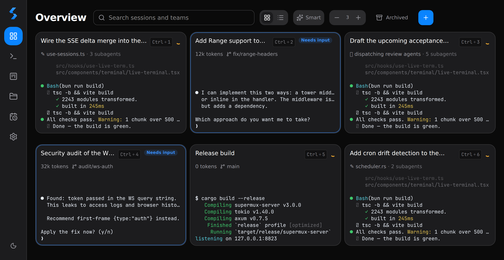
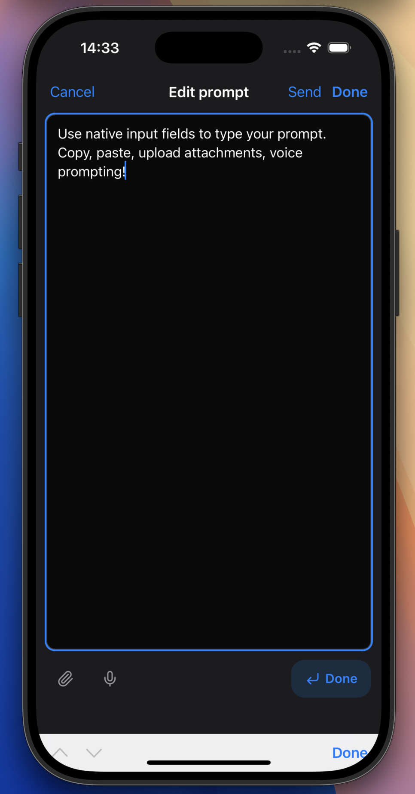

<h1 align="center">supermux</h1>

<p align="center"><strong>Hire a company of AI teammates — and run it from your phone.</strong></p>

<p align="center">Named bots with real roles, their own files, and shared tools. They message each other, use a real browser, and keep working after you close your laptop. Open source, self-hosted, on your own Claude subscription.</p>

<p align="center"><em>Close your laptop. Your company keeps working, and your phone buzzes the second a bot needs you.</em></p>

<p align="center">
  <!-- Bot Mode hero. Embedded as  so it autoplays everywhere GitHub renders
       (web logged-out, iOS Safari, the GitHub mobile app, IDE previews) and
       degrades to a clean static first frame. Click-through opens the HD MP4.
       Every frame is the real UI, shot from the app's own mock/dev surfaces. -->
  <a href="docs/hero.mp4"></a>
</p>

<p align="center"><sub>▶ <a href="docs/hero.mp4">Click for HD</a> · the loop above autoplays on GitHub</sub></p>

<p align="center"><sub>An open-source, self-hosted AI company you run yourself.</sub></p>

<p align="center">
  <a href="https://github.com/sanderbz/supermux/releases/latest"></a>
  <a href="LICENSE"></a>
  <a href="https://github.com/sanderbz/supermux/stargazers"></a>
  
  
</p>

---

## What this is

**Bot Mode turns supermux into a company of AI teammates you host yourself.** You hire named bots, give each one a role, its own folder, and the tools it's allowed to touch, then group them into companies where they share connectors, talk in a central chat, and hand work off to each other. It's [Claude Code](https://code.claude.com/docs/en/setup) under the hood — as capable, and as fallible, as the agent driving it — running on a box you own and steered from your phone.

If you've seen xAI's Grok bots — always-on AI teammates that get their own computer, sign into your tools, and keep working after you log off — **supermux is that idea, open source and self-hosted**: same shape, your box, your Claude subscription, no per-seat cloud.

---

## Install in one line

SSH into a fresh Ubuntu 22.04+ / Debian 12+ box and run:

```bash
curl -fsSL https://raw.githubusercontent.com/sanderbz/supermux/main/install.sh | sudo bash
```

Under a minute on a typical VPS. Downloads the prebuilt binary for your CPU, provisions an unprivileged `supermux` service user, installs the systemd unit, starts the service, prints your URL + auth token. Re-run any time to upgrade, sessions and data are preserved. Tailscale and Claude Code are auto-detected and offered. Full quickstart details and flags are [below](#full-quickstart).

Then stand up your first company:

```
1. Open the printed URL, log in once with your Claude subscription.
2. Enable Bot Mode in Settings → hire your first bot (name it, give it a role + folder).
3. Group a few bots into a company, connect Gmail/GitHub, and give them a job.
```

---

## Meet your bots

### A bot is a teammate with a role

A bot has a name, an avatar, and a role you assign — *Ada the developer*, *Iris the marketer*, *Sol in sales*. Each one gets **its own folder** on the box (its filesystem, scoped to what it's allowed to touch) and **its own connectors**. It's a full Claude Code agent with a job, not a scratch chat window.

<p align="center">
  <a href="docs/screenshots/hire-sheet-phone.png"></a>
</p>

<p align="center"><sub><em>Hiring a bot is one sentence.</em></sub></p>

<p align="center">
  <a href="docs/screenshots/chat-phone.png"></a>
</p>

<p align="center"><sub><em>Every tool call, as it happens.</em></sub></p>

<p align="center">
  <a href="docs/screenshots/chat-desktop.png"></a>
</p>

<p align="center"><sub><em>Seven bots, one rail — and they can talk to each other.</em></sub></p>

### Companies

Group bots into a **company** and they share connectors, a central **company chat**, and a shared browser. Bots **message each other and hand tasks off**: the marketer asks the developer for the changelog, the developer drops it in the shared drive, the sales bot picks it up. You set the direction; they do the passing.

<p align="center">
  <a href="docs/screenshots/groupchat-phone.png"></a>
</p>

<p align="center"><sub><em>You ask once. The router picks who does it.</em></sub></p>

### Connectors

Plug bots into the tools you already use — Gmail, GitHub, your database, anything — **with or without an MCP server or API**, via the connect concierge and one-tap sign-in. Grants are per-bot: a bot only reaches the connectors you hand it.

<p align="center">
  <a href="docs/screenshots/connector-store.png"></a>
</p>

<p align="center"><sub><em>A store of tools, granted per bot — not per box.</em></sub></p>

### Workflows

A **workflow** is an ordered list of prompts a bot runs on a trigger: chain the steps, run them on a schedule, and fire a completion action when it's done. Ship the weekly report every Monday without lifting a finger.

<p align="center">
  <a href="docs/screenshots/workflow-runs.png"></a>
</p>

<p align="center"><sub><em>Give a bot a job and a time. It tells you what happened — including the failures.</em></sub></p>

### A shared company browser

One real Chrome the company shares — **log in once**, then lend individual tabs to named bots. When a bot hits a login wall you can **take the wheel**, sign in, and hand the tab back.

<p align="center">
  <a href="docs/screenshots/browser-drive.png"></a>
</p>

<p align="center"><sub><em>When it's stuck, take the wheel — then hand it back.</em></sub></p>

---

## Why Bot Mode

You don't want *a chatbot*. You want the work done — the repo shipped, the leads emailed, the competitor teardown written, the weekly report out the door — while you're doing something else.

A single Claude session is a genius with amnesia and one pair of hands. Bot Mode gives you a **team**: named bots, each with a role, its own folder, and the tools it's allowed to touch. Group them into a **company** and they share connectors, talk in a central chat, and hand tasks to each other — the marketer asks the developer for the changelog, the developer drops it in the shared drive, the sales bot picks it up. You set the direction; they do the passing.

And it's **yours**. Not a seat in someone's cloud that costs $200/month and holds your logins. One Rust binary on a $5 VPS, a Raspberry Pi, or the Mac mini in your closet. Your Claude subscription. Your files, your browser session, your data — behind a systemd sandbox on a box you own. Close the laptop; the company keeps running; your phone buzzes when a bot needs a decision.

### Bot Mode vs Grok Bot vs rolling your own

The pitch that made Grok bots go viral — a team of agents that never sleeps — minus the vendor cloud and the $200 seat.

| | **Supermux Bot Mode** | Grok Bot | DIY glue |
|---|:---:|:---:|:---:|
| Named bots with roles, own folder + tools | ✅ | ✅ | ⚠️ you build it |
| Bots message each other + hand off work | ✅ | ✅ | ❌ |
| Group bots into companies (shared connectors + chat) | ✅ | ⚠️ teams | ❌ |
| Connect to your tools, MCP **or** no-MCP | ✅ | ✅ | ⚠️ |
| Shared browser you log into once, lend per-tab | ✅ | ⚠️ | ❌ |
| Workflows (scheduled multi-step chains) | ✅ | ✅ skills | ⚠️ cron |
| Runs on **hardware you own** | ✅ | ❌ vendor cloud | ✅ |
| Drive it all from your **phone** (real push) | ✅ | ✅ | ❌ |
| Uses **your** Claude subscription, no per-seat SaaS | ✅ | ❌ $120–200/seat | ✅ |
| Open source (MIT), self-hosted, your data | ✅ | ❌ | ✅ |

<sub>⚠️ on Grok's cells = we can't verify their internals. Best-effort snapshot of fast-moving products — corrections welcome via PR. Supermux runs Claude Code (and Codex); **it is not affiliated with xAI**.</sub>

---

## It's a real harness, not a toy

Bot Mode runs on top of a real product. Underneath the companies is the thing supermux has always been: **the easiest way to run a roomful of Claude Code agents from your phone** — live overview, real push, resume, files, MCP/skills, remote hosts.

<p align="center">
  <a href="docs/screenshots/overview-desktop.png"></a>
</p>

<p align="center"><sub><em>Every bot, ranked by who needs you.</em></sub></p>

<p align="center">
  <a href="docs/screenshots/overview-phone.png"></a>
</p>

<p align="center"><sub><em>The same control room, in your pocket.</em></sub></p>

- **All your Claude sessions in one live view.** Color-true terminal previews, sub-second fresh. See who's typing, who's waiting on you, who's idle.
- **Notifications when Claude needs you.** Real push (PWA, real iOS push) the second Claude asks a question, finishes a task, or stops. Per-category mute.
- **Quick peek + type-in-place.** Hover a tile on desktop or long-press on mobile to read the latest output and reply without leaving the overview.
- **A full lifecycle harness.** Start, stop, restart with a flag, resume an older conversation, rename inline, archive — all from the UI.
- **Schedule recurring prompts.** Cron and "every Nm/Nh" jobs, an iCal feed, a live job list — routine work happens without you.
- **A terminal made for Claude Code.** Attach a file or photo and it drops the path at Claude's prompt; Markdown and code render with real syntax highlighting; edit prompts in a native textarea; tap Claude-specific actions (cycle permission mode, rewind, approve) a plain SSH app can't know about.
- **Mixed fleets welcome.** Claude Code is the default; the same overview runs [Codex CLI](https://developers.openai.com/codex/cli/) sessions side by side.

<p align="center">
  <a href="docs/screenshots/terminal-focus.png"></a>
</p>

<p align="center"><sub><em>A terminal that knows it is running Claude Code.</em></sub></p>

<details>
<summary><strong>The full feature list (overview, notifications, history, uploads, hosts, and more)</strong></summary>

### See every agent, jump anywhere
- **Live overview** with color-true terminal previews. Refresh tiers self-throttle: 1 s for hot-active sessions, 2 s for the rest active, 4 s idle.
- **Quick peek**: hover a tile (desktop) or long-press it (mobile) to read the latest output, type a reply, or hit a quick action without leaving the overview.
- **Focus mode**: tap any tile to zoom into a keyboard-captured xterm.js terminal (desktop) or a detented bottom-sheet (mobile). `⌘1..9` jumps instantly between sessions.
- **⌘K command palette**: fuzzy search across sessions, slash commands, MCP tools, and Claude Code skills.
- **Mixed fleets welcome**: Claude Code is the default, but the same overview runs [Codex CLI](https://developers.openai.com/codex/cli/) sessions side by side — same live status, push notifications, and prompt history.

### Notifications that find you
- **Real push notifications** when Claude finishes, asks a question, or stops. Works on iOS too: install the PWA, allow notifications, walk away from your machine.
- **Per-category mute**: silence "waiting for input", keep "agent finished" loud, never miss "stopped unexpectedly".

### Stay organized at scale
- **Custom groups**: drag tiles between groups, name them whatever (`production`, `experiments`, `Claude Boy and Friends`).
- **Six sort modes per group**: Smart / Custom / Name / Status / Recent / Age. Persisted server-side, synced across devices.
- **Agent Teams**: when an agent spawns a team, supermux detects the lead + members and collapses them into one TEAM CARD. Convert any session into a team in place.
- **Hide-stopped, view-mode dropdown**: calm the noise on a busy day.

### Pick up where you left off
- **Rich prompt history**: every prompt you sent to a session, searchable, with the assistant's first-line reply paired in. Tabbed: just this session, or the whole project (every Claude Code transcript under this cwd). Press `⌘G` in focus mode.
- **Slash-commands and teammate routings** show up as their own kinds in history with mini badges. Sub-agents and system events available behind toggles.
- **Resume picker**: supermux reads Claude Code's own JSONL transcripts, so any past conversation in this cwd is one tap away from a `claude --resume`.

### Edit prompts in a real textarea
- **✎ Edit** in the dock lifts whatever you've typed at Claude's `❯` prompt into a browser-native textarea: iOS selection handles, autocorrect, dictation, paste-over-select.
- **Done** writes back, you hit Enter when ready. **Send** writes back and submits.
- Mobile gets a full-page edit surface with proper safe-area handling.
- Built on Claude Code's own `chat:externalEditor` (Ctrl+G) bridge. No scraping, no keystroke replay.

<p align="center"><a href="docs/screenshots/native-input.png"></a></p>

### Drag-and-drop uploads
- **Drag a file onto the terminal pane** on desktop and supermux uploads it server-side, then pastes the resolved path at Claude's cursor.
- **Native file picker** on mobile, with a tap-to-upload action sheet.
- Image previews, paste-image-from-clipboard, the lot. The thing that always sucks over plain `ssh`.

### Keep Claude working while you're away
- **Scheduler**: cron and "every Nm/Nh" jobs. Schedule a daily `claude --resume` with a prompt. iCal feed. Live job list.
- **Issue tracker**: session-scoped issues, read from the session that owns them (and from a team's card). Sessions can comment, mark issues done, attach commits, or ask for input via per-session hook tokens. Wire it into your agent flow and let Claude pull its own next task.
- **Schedules and issue updates trigger push notifications** when something needs you.

### Reach across machines
- **Add any host you can SSH to** under Settings → Hosts (Tailscale, VPN, public DNS, reverse tunnel). supermux multiplexes one SSH ControlMaster per host.
- **One-click bootstrap** installs the `authorized_keys` entry and verifies prereqs.
- New sessions can target any host from the same sheet; remote tiles wear a discreet badge.

### The rest
- **Inline session rename**: live `tmux` rename + pty survival.
- **Per-session git status**: branch, dirty, ahead/behind, on demand.
- **Files browser**: path-jailed, with an editor.
- **MCP & Skills** in the palette: toggle MCPs per session, tap-activate skills.
- **Mode shift**: flip Claude Code's permission mode (normal / accept-edits / plan / bypass) without a relaunch.
- **In-UI updater**: Settings → Updates. 1-click upgrade with live SSE progress and auto-rollback on failure. (Needs a source clone on the server; one-liner installs upgrade by re-running the installer.)

</details>

### …and it's still the best way to run plain Claude Code sessions

Even before Bot Mode, supermux is the only Claude-Code runner that adds the whole **mobile + remote + push + self-host** dimension — your agents live on a server you own, not on the laptop in your bag.

|  | **supermux** | Conductor<br>(Mac app) | Omnara<br>(cloud) | Happy<br>(mobile) | claude-squad<br>(TUI) |
|---|:---:|:---:|:---:|:---:|:---:|
| Many agents in one live overview | ✅ | ✅ | ✅ | ✅ | ✅ |
| Sub-second "who's waiting on you" status | ✅ | ⚠️ | ⚠️ | ❌ | ❌ |
| Mobile-first PWA (real iOS / Android) | ✅ | ❌ | ✅ | ✅ | ❌ |
| Real push when an agent needs you | ✅ | ❌ | ⚠️ via cloud | ⚠️ | ❌ |
| Agents run server-side, survive the laptop closing | ✅ | ❌ | ❌ | ❌ | ⚠️ |
| Runs on a VPS / Pi / Mac mini, not your laptop | ✅ | ❌ | ❌ | ❌ | ⚠️ |
| Self-hosted, no vendor cloud in the path | ✅ | ✅ | ❌ | ✅ | ✅ |
| Full lifecycle harness (start/stop/restart/resume/schedule) | ✅ | ⚠️ | ⚠️ | ⚠️ | ⚠️ |
| Issue tracker agents read & write | ✅ | ❌ | ❌ | ❌ | ❌ |
| Open source | ✅ MIT | ❌ | ⚠️ CLI only | ✅ | ✅ |

<sub>Best-effort snapshot of fast-moving tools — corrections welcome via PR.</sub>

---

<a id="full-quickstart"></a>

## Full quickstart

The [one-liner above](#install-in-one-line) covers the common case. A few flavours for everything else:

**Pinned version**: same one-liner with `SUPERMUX_VERSION=vX.Y.Z` added to the env (e.g. `… | sudo SUPERMUX_VERSION=v0.4.23 bash`).

**Inspect before running**:
```bash
curl -fsSL https://raw.githubusercontent.com/sanderbz/supermux/main/install.sh -o install.sh
less install.sh
sudo bash install.sh
```

**Dry run** (print the plan, change nothing): append `--dry-run` to the bash command.

**Tailscale**: if `tailscaled` is running on the box, supermux auto-exposes via `tailscale serve` on `:443`. Otherwise it binds to `127.0.0.1:8824` for your own reverse proxy.

**Claude Code**: the installer offers to install it for the service user if missing (official native installer, no Node). Log in once with `sudo -u supermux -i claude` → `/login`.

**Turn on Bot Mode**: enable Bot Mode in Settings once you're logged in, then hire your first bot and group a few into a company. Bot Mode is a mode you switch on — the whole harness above works with it off.

**Codex**: the New session panel keeps Claude as its default and offers OpenAI's Codex CLI alongside it. Its first start installs the official CLI (user-scoped) if needed and opens the login flow right in the terminal; later starts reuse that login. It gets the launch flags that keep its output readable in a supermux tile, and it feeds the same status detection — the tile knows when Codex is working, waiting on an approval, or done, just like Claude.

**After install**: open the printed URL on any device. On mobile, "Add to Home Screen" gives you the full PWA experience including push notifications.

### Other paths

- **From a clone**: `sudo bash install.sh` from a checkout still installs the latest *release* binary. It never builds your local code. For a source build use `scripts/dev.sh` (local dev) or [`scripts/deploy.sh`](scripts/deploy.sh) (native build + deploy).
- **Deploy over SSH from your workstation** (advanced: fleet management of many boxes): see [`scripts/deploy.sh`](scripts/deploy.sh) and `bash scripts/setup.sh`.
- **Local development** with HMR: `scripts/dev.sh` (Rust backend on `:8823`, Vite for the PWA).

---

## Built for self-hosting

- **One Rust binary, with the PWA embedded.** No Node, Docker, or Python at runtime. One file plus a SQLite DB.
- **systemd-sandboxed by default**: runs as an unprivileged user with `NoNewPrivileges`, `PrivateTmp`, `ProtectHome`, restricted address families, and `ReadWritePaths` scoped to the data dir + your project dirs.
- **Auth on every API route**: bearer token at `~/.supermux/auth_token` (mode `0600`). No localhost bypass.
- **Tmux survival**: the tmux socket lives in the persistent data dir, so sessions outlive supermux restarts.
- **In-UI 1-click updates**: `git fetch → build → install → verify → auto-rollback on failure`, exposed as a button. Preflight refuses unsafe upgrades. Needs a source clone on the server (clone-based installs); prebuilt-binary installs upgrade by re-running the one-line installer.

### Supported platforms (for hosting)

This is about where the *server* runs. The dashboard itself works in any modern browser on macOS, Windows, iPhone and Android.

- **Linux**: Ubuntu 22.04+ / Debian 12+ with systemd, `x86_64` and `aarch64`. This is what the one-line installer, the systemd sandbox, and the in-UI updater target. Other distros with systemd generally work but aren't tested.
- **macOS**: works, manual install. Nothing in supermux itself is Linux-only; a Mac mini in a closet makes a fine supermux box (that's a real deployment). Build from source (`bash scripts/build.sh`, see [`docs/TESTING.md`](docs/TESTING.md)) and run the binary; keep it alive with `launchd` or tmux. The one-line installer and the auto-updater don't cover macOS yet.
- **Windows**: not supported (relies on Unix-only primitives like `tmux`, ptys, SIGWINCH, Unix domain sockets). WSL2 works as a Linux host.

Building from source needs: `rustc 1.83+`, a recent `bun` 1.x, and the system build deps `build-essential pkg-config libssl-dev cmake unzip`. `tmux` is a runtime dep; [Claude Code](https://code.claude.com/docs/en/setup) is the default agent (the one-line installer offers to install it for you). [Codex CLI](https://developers.openai.com/codex/cli/) is an optional additional provider; its first session bootstraps the service-user install and login.

### Tailscale-ready

If `tailscaled` is running on the target host, the installer auto-detects it and exposes supermux via `tailscale serve` on `:443`. Rename once (`sudo tailscale set --hostname=supermux`) and you have a clean, HTTPS, internal-only URL on every device on your tailnet.

---

## Honest limits

- **Bot Mode is a mode you enable**, not a separate product. The whole harness works with it off; you switch it on when you want companies and bots.
- **Company isolation is best-effort, not a hard multi-tenant jail.** Separation is app-layer scoping plus the systemd sandbox (and best-effort Landlock where the kernel allows) — sandboxed isolation on a box you control, not fully isolated tenants. Don't host mutually-hostile companies on one instance. A company that legitimately needs more than the default allow-list gets it per company via `[[company_isolation]]` (see *Company isolation* under the deploy guide), never by switching the sandbox off for everyone.
- **Letting outside humans into a company needs your own domain + OAuth.** Out of the box supermux is single-owner behind an auth token (and ideally Tailscale); external human access is your setup to add.
- **It runs Claude Code.** Bot Mode is as capable — and as fallible — as the agent driving it. It does the things you could do at a keyboard, and it makes the mistakes an agent makes. Keep a human in the loop for anything that matters.
- **Chat renders permission prompts; it can't answer them yet.** When Claude asks to run something, the card shows up in chat with the command and its options — and says out loud that you have to answer it in the terminal. The screenshot below is the real state, footnote and all.

<p align="center">
  <a href="docs/screenshots/chat-permission-phone.png"></a>
</p>

<p align="center"><sub><em>Claude asks. Chat shows you what it's asking — and where you have to answer.</em></sub></p>

---

<details>
<summary><strong>Architecture</strong></summary>

- **Backend**: Rust (`axum` + `tokio` + `sqlx`/SQLite), in `server/`.
- **Frontend**: TypeScript + React + Vite PWA, in `web/`.
- **Process model**: single binary; tmux runs out-of-process on a persistent socket so sessions survive restarts.
- **Live data path**: WebSockets for terminal pty streams (binary frames); SSE for everything else (session lists, status, board, push, alerts).

Module map and protocol details: [`ARCHITECTURE.md`](ARCHITECTURE.md).

</details>

<details>
<summary><strong>Deploy guide (full reference)</strong></summary>

`scripts/deploy.sh` runs from your workstation and ships a pinned `git archive` of a clean commit *over SSH* to a remote host (not the machine you run it on), builds natively there (no cross-compilation), installs `/usr/local/bin/supermux-server` plus the systemd unit, and starts the service. It runs an upfront preflight and prints a one-page plan before doing anything destructive.

### Defaults

- **Non-root by default, even from a root SSH session.** Root provisions; the service drops to the unprivileged `supermux` user. Forcing root throws away the systemd sandbox and trips Claude Code's refusal to run `--dangerously-skip-permissions` as uid 0, so it's refused unless you explicitly set `SUPERMUX_ALLOW_ROOT=1`.
- **Service user**: `SUPERMUX_SERVICE_USER` (default `supermux`). If it doesn't exist, `deploy.sh` provisions it. Pick a non-default name and the script refuses rather than silently creating something unexpected; `root` is refused unless `SUPERMUX_ALLOW_ROOT=1`.
- **Repo dir for the updater**: the in-UI updater builds from a git clone, auto-detected at `/opt/projects/supermux` (falling back to walking up from the binary's CWD). Set `SUPERMUX_REPO_DIR=/path/to/clone` for non-standard layouts.
- **Project directories**: `SUPERMUX_PROJECT_DIRS` (default `<user-home>/projects`). Under-home dirs just work; outside-home dirs (`/opt/projects`, `/srv/work`, …) are created, `chown -R`'d, and folded into the systemd `ReadWritePaths` so the sandbox permits agent writes.
- **Claude Code (the agent runtime)**: every non-shell session launches the `claude` binary on the service user's PATH, so it's a runtime dependency for the default provider. After provisioning, `deploy.sh` checks whether the service user has `claude` and, when missing, installs it (official native installer, no Node) per `SUPERMUX_INSTALL_CLAUDE` (`ask` = offer interactively, `1` = auto, `0` = warn only).
- **Service-user Claude login**: supermux uses your Claude subscription (OAuth), never an API key. After confirming the binary, `deploy.sh` checks for `~supermux/.claude/.credentials.json` and offers to copy the deployer's existing login.
- **Tailscale**: auto-detected. If `tailscaled` is running, `deploy.sh` exposes the service via `tailscale serve` on port `443`.
- **Secrets & Git SSH keys for agents**: to let agents reach a Git SSH key and other secrets from 1Password on a headless box (no desktop app), use a scoped read-only **service account** + the `op` CLI, with the Git key loaded into an in-memory `ssh-agent`. Step-by-step (generalized, copy-pasteable): [`docs/SECRETS_1PASSWORD.md`](docs/SECRETS_1PASSWORD.md).
- **Toolchains**: `bun` and `cargo` are required (native build). `SUPERMUX_INSTALL_TOOLCHAINS=1` opts in to automatic install via the official `bun` + `rustup` installers; otherwise missing toolchains are a hard error with manual instructions.

### TLS

The service binds `127.0.0.1` and speaks plain HTTP. Put it behind TLS one of two ways:

1. **Reverse proxy** (nginx, Caddy) terminating at `http://localhost:<SUPERMUX_INTERNAL_PORT>` (default `8824`). See **WebSocket origins** below; a proxied hostname usually needs an `extra_origins` entry.
2. **`tailscale serve`**: set `SUPERMUX_USE_TAILSCALE=1` and `deploy.sh` runs `tailscale serve --https=<SUPERMUX_PUBLIC_PORT>` to terminate TLS and proxy to the loopback port.

### WebSocket origins

supermux checks the browser's `Origin` header on every WebSocket upgrade and closes non-matching connections with code `1008 "origin not allowed"`. The built-in allowlist covers `localhost`, `127.0.0.1`/`::1`, private-LAN IPv4 ranges, `*.ts.net` (Tailscale), and the server's own bind address. If you reach supermux by a hostname that isn't one of those (a reverse-proxy domain, an internal DNS name), add it to `extra_origins` in `~/.supermux/config.toml`:

```toml
bind = "127.0.0.1:8824"
extra_origins = ["supermux.corp.example", "box-12.internal.example"]
```

Exact host match only (no wildcards). Restart the service after editing.

### Company isolation

Company bots run in an OS jail (Landlock on Linux, Seatbelt on macOS) whose allow-list is deliberately narrow: the company folder, `~/.claude`, `/tmp` and the toolchains. `isolation_mode` in `config.toml` sets the policy — `best-effort` (default, fails open with a warning where the kernel cannot enforce), `strict-required` (refuse to start a company bot unless the jail is enforced) or `off`.

A bot that legitimately needs more — a fleet-admin bot that must read the operator's `~/.ssh` and `~/.config/gh` — gets it per company, not by switching the jail off for everyone:

```toml
# ~/.supermux/config.toml
[[company_isolation]]
company = "canary"                        # the company slug (its folder name under companies/)
read_only = ["~/.ssh", "~/.config/gh"]    # read (+exec) only
read_write = []                           # read + write
```

Sibling companies keep the default list. Entries are checked on their real (canonical) path and refused with a logged reason when they are relative, contain `..`, do not exist yet, resolve through a symlink, are `/` or the home dir (or an ancestor of it), sit at/under/above the supermux data dir (`~/.supermux` by default: auth token, DB, vault), or point into another company's tree (or the companies root itself). `config.toml` is read once when supermux starts — restart the service after editing it; each company bot is then confined with the new list at its next (re)start.

### Verify

```bash
curl -sf http://127.0.0.1:<SUPERMUX_INTERNAL_PORT>/api/health
journalctl -u supermux -n 50
```

Public routes are `/api/health`, the PWA shell, and the issue iCal feed. Everything else needs the bearer.

</details>

<details>
<summary><strong>Push notifications setup</strong></summary>

The PWA's iOS push works out of the box with a placeholder VAPID contact. To use your own `mailto:`, set `push_sub = "mailto:you@your-domain"` in `~/.supermux/config.toml`, or export `SUPERMUX_PUSH_SUB`. Settings → Notifications has a **Send test** button to confirm delivery before you trust it for real alerts.

iOS specifics: Safari only allows push from installed home-screen PWAs, so add to home screen first, then grant notification permission inside the installed app.

</details>

---

## Contributing

Issues, ideas, screenshots of your dashboard with 14 Claude sessions: all welcome. See [`CONTRIBUTING.md`](CONTRIBUTING.md) for the dev setup. Security issues: please report privately via [`SECURITY.md`](SECURITY.md). PRs land via review; CI runs on every push to `main`. Heavy code paths (sessions, ws, scheduler, board) have inline `#[cfg(test)]` tests plus integration tests under `server/tests/`. The frontend is type-checked end-to-end with `tsc -b` and uses Playwright for e2e smoke.

## License

MIT, see [`LICENSE`](LICENSE). Third-party dependency licenses are summarized in [`THIRD_PARTY_NOTICES.md`](THIRD_PARTY_NOTICES.md).
